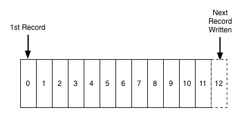

#The Log: What Every Software Engineer Should Know About Real-time Data's Unifying Abstraction

我在六年前加入LinkedIn，那是一个令人兴奋的时刻，我们刚开始面临单一庞大的集中式数据库的限制问题，需要迁移到一套特殊的分布式系统上，这是一段令人兴奋的经历：我们构建、部署分布式图数据库、分布式搜索后端、hadoop、第一代和第二代键值对存储，并且一直运行到今天。

在这个过程中，我学到的最有用的事就是我们所构建的这套组件的核心的一个非常简单概念就是：日志。有时叫预先写入日志或提交日志或者事务日志，几乎与计算机形影不离，并且是许多分布式数据库和实时应用架构的核心。

如果不懂得日志，那么你不可能理解数据库、NoSQL存储、键值对存储、备份、paxos、hadoop、版本控制或者几乎所有的软件系统。然而大多数的软件工程师对日志并不熟悉，我想改变这个状况。在本文中，我将带你浏览关于日志所需知道的一切，包括日志是什么，怎么在数据集成、实时处理和系统构建中使用日志。

## 第一部分：日志是什么

日志可能是最简单存储抽象。只能追加，按时间完全有序的的记录，它看起来像这个样子：

在日志的末尾添加日志，读取日志是从左到右，每一条日志都被赋予了唯一顺序的日志编号。
记录的顺序定义了"时间"的概念，因为位于左边的记录要比位于右边的记录早。日志记录的编号可以看作是记录的"时间戳"。把次序直接看作是
时间概念可能看起来怪怪的，但是这样做有个便利的地方：解耦了时间与任何物理时钟的关系。引入分布式系统后，这个特性必不可少。

日志记录的内容和格式并不是本文讨论的重点，当然我们不可能一直添加记录，因为会耗尽存储空间，稍后回来讨论这个问题。

所以日志和文件或者数据表(table)并没有大的不同。文件是一系列的字节，表是一系列记录组成，而日志实际上只是一直按着时间顺序存储记录的数据表或文件。

讨论到现在，也许你会怀疑值得讨论这么简单的事吗？只能追加顺序日志记录与数据系统有什么关系？答案是日志有其特定的目标：它记录了什么时间发生，发生了什么。对于分布式数据系统来说，这些都是问题的核心。

但是在我们深入讨论之前，先澄清几个容易混淆的问题。每个程序员都熟悉日志的另一种定义：应用syslog或者log4j写入到本地文件里的无结构的错误信息或者追踪信息。为了区分，这种情形称为应用日志记录。
应用日志记录是我说的日志概念的一种退化。两者最大的区别是：文本日志意味着主要用来方便人去阅读，而构建我所说的日志(journal)或者数据日志(data logs)是用于程序的访问。

